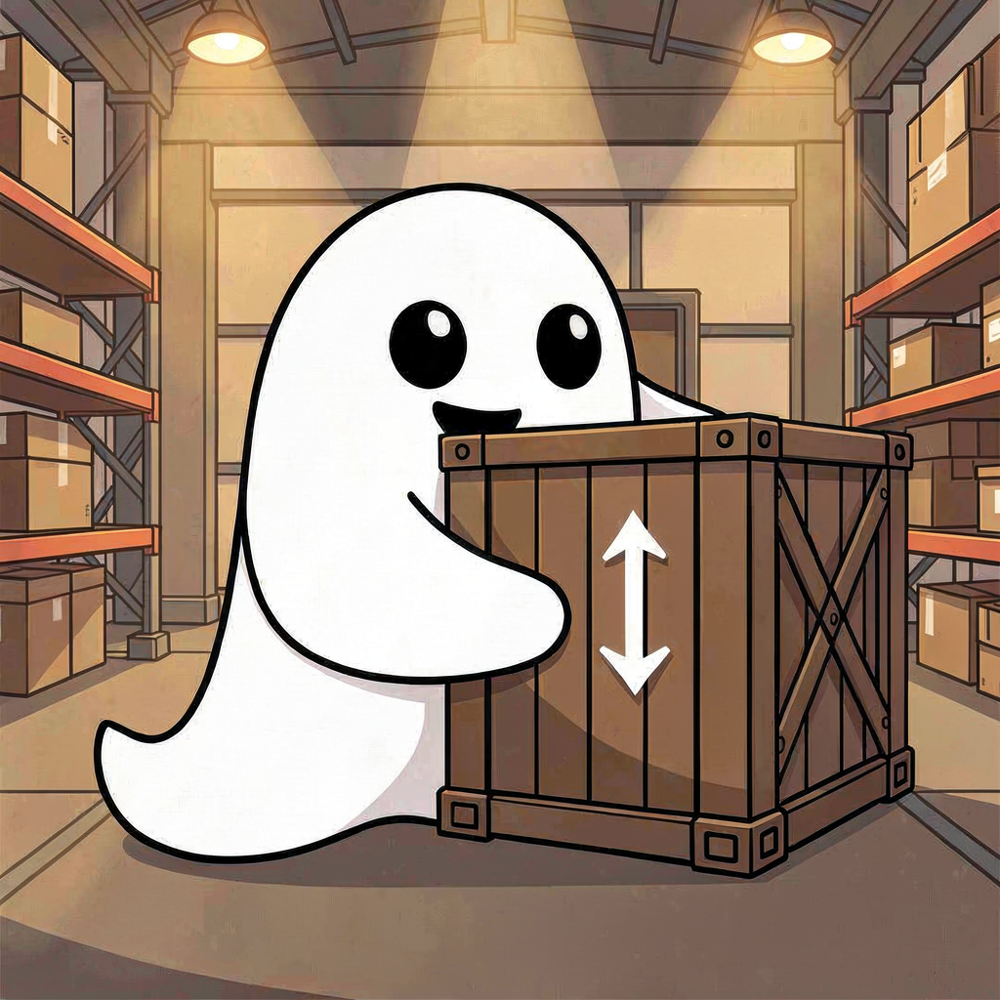

*Launch Ghostships from the Ghost Academy and command the crew.*

A multi-agent orchestration system for [KiroCrew](https://github.com/kirodotdev/KiroCrew) over MCP.
Customise agent personas, skills and steering, then send them out into the unknown.
Runs locally and remotely on macOS or Linux using Podman.

[](https://github.com/mcteamstar/ghostship/actions/workflows/test.yml)

**Quick install (Claude Code plugin):**
```bash
claude plugin marketplace add mcteamstar/ghostship
claude plugin install ghostship@ghostship
```
Use the skill `/ghostship-admin` for guided local setup, `/ghostship-capability` to customise the academy, and `/ghostship-command` to drive the fleet. See [Install](#install) below for full steps.

## Why Ghostship?

KiroCrew is designed for running teams of agents over long horizon tasks, but running KiroCrew on your desktop limits you to one instance, directly on your filesystem, with limited isolation between crewmates.

`ghostship` runs each crew in its own container and makes dedicated workspaces via podman volumes. Each ship is a durable workspace, summoned once (`launch`) and reusable across multiple features; with idle resource management when not in use. At the same time, ghostships are also expendable and can be torn down cleanly (`nuke`) at any time.

As the **Admiral** you can command your crews over MCP from any agent. Delegate orders to the crew's **Captain** or be the captain yourself. All the ships in your *fleet* run side by side without colliding, and can be tailored to your tactical needs.

The built-in `spec-ops` loadout is designed for **Spec-Driven Development** using [OpenSpec](https://github.com/Fission-AI/OpenSpec). Kiro is fast and cost-efficient at executing well-defined change specs, and is versatile enough to handle the whole SDD cycle when needed. Agents currently default to `gpt-5.6-luna` but this, amongst many other things, is configurable and overridable (see [docs/configuration.md](docs/configuration.md)).

### Why Not...

**Subagents?** Subagents are tied to your parent session, and share your live workspace directly. Crew members are just KiroCrew subagents on a ghostship.

**Cloud Agents?** Cloud agents run on infrastructure outside of your control. Crew container images can be tailored to your development needs within a security boundary you own. Ghostship can be hosted remotely like a private cloud agent.

**Agent Harnesses?** You could absolutely make a DIY orchestration system for regular harnesses to improve parallelism, concurrency and inter-agent communication. Ghostship is literally just that layer for KiroCrew, and is consumable by any agent over MCP.

## Install

### Prerequisites

Install these before running `./install.sh`:

- macOS or Linux
- **Podman >= 4.4** — `brew install podman` (macOS), `sudo apt-get install -y podman podman-compose` (Ubuntu/Debian)
- **`podman-compose`** — `brew install podman-compose` (macOS); included in the apt command above
- A kiro-cli identity — Builder ID / Social Login, or an IAM Identity Center account (see [docs/auth.md](docs/auth.md))

Other distros: [docs/manual-install.md](docs/manual-install.md). Requires cgroup v2 and Podman rootless. Verified on Ubuntu 22.04+.

> **Model access:** Ghostship defaults to `gpt-5.6-luna`, which requires a Pro subscription or higher. See [kiro.dev/docs/models](https://kiro.dev/docs/models/) for available models by tier, and [docs/configuration.md](docs/configuration.md) for how to override.

### Setup

```bash
./install.sh
```

Builds the crew images and starts the `ga-transport` container on `localhost:64057`. MCP, REST API, and file transfer all share this single port.

For a repeatable setup, copy the example config and fill in your values before running:

```bash
cp config/ghostship.conf.example config/ghostship.conf
# edit config/ghostship.conf, then:
./install.sh --config config/ghostship.conf
```

**API key** — for any non-local deployment (or if you just want auth), pass `--api-key <key>` to lock the endpoint:

```bash
./install.sh --api-key <key>
```

To uninstall: `ghostship uninstall`. If ghostship stops after a reboot, run `ghostship start` to bring it back without reinstalling.

**Updating academy/ and crews/** — `./install.sh` snapshots `academy/` and `crews/` from the repo into the data volume. The transport has no runtime dependency on the repo checkout path. After editing files under `academy/` or `crews/`, re-run `./install.sh` for changes to take effect. See [Updating academy/ and crews/](docs/configuration.md#updating-academy-and-crews) in the configuration docs.

Full install options and environment variables: [docs/configuration.md](docs/configuration.md).

### Customising and forking

Run it as-is or make it your own. Once you start adding agent personas,
skills, or new crew compositions, that configuration belongs in your own
fork. See [docs/forks.md](docs/forks.md) for the fork model, visibility
options, and how to keep your fork current with upstream.

### Connecting to a harness

Before your first `launch`, complete the device auth flow — open the URL returned by `POST /login` or by calling `launch` without auth. See [docs/auth.md](docs/auth.md) for the walkthrough.

> **Shortcut:** `ghostship setup` automatically registers the MCP server and installs skill symlinks for detected agent clients (kiro-cli, Claude Code, opencode). Run it after `./install.sh` as an alternative to the manual JSON/CLI steps below. It is idempotent — safe to re-run.

**Kiro (via Power):**

Install the ghostship power from the Powers panel → Add Custom Power → Import from GitHub:
```
https://github.com/mcteamstar/ghostship
```
The `ghostship-admin` skill walks you through the rest — Podman, `./install.sh`, auth, and connecting. See `.claude-plugin/PACKAGING.md` for keyed and remote installs.

**kiro-cli:**
```bash
# Without API key:
kiro-cli mcp add --name ghostship --url http://localhost:64057/mcp --scope global

# With API key:
kiro-cli mcp add --name ghostship --url http://localhost:64057/mcp \
  --headers '{"Authorization": "Bearer ${GHOSTSHIP_API_KEY}"}' --scope global
```

**Claude Code (plugin):** see the quick install command at the top of this
README. It installs the `ghostship-admin`, `ghostship-command`, and
`ghostship-capability` skills plus an unauthenticated connection to
`http://localhost:64057/mcp`. `ghostship-admin` guides installation and
connecting; `ghostship-command` is the Admiral's fleet playbook;
`ghostship-capability` covers academy and crew customisation.

**Claude Code (manual, keyed, or remote)** — add to `~/.claude.json`'s
`mcpServers`:
```json
"ghostship": {
  "type": "http",
  "url": "http://localhost:64057/mcp",
  "headers": { "Authorization": "Bearer ${GHOSTSHIP_API_KEY}" }
}
```
Omit `headers` if API-key auth is disabled.

For remote deployments, IAM Identity Center config, and TLS setup: [docs/remote.md](docs/remote.md) and [docs/auth.md](docs/auth.md).

### Skills

> **Strongly recommended:** install the `ghostship-command` skill into your agent. Without it, your agent has the MCP tools but no guidance on how to use them effectively — `ghostship-command` is the Admiral's fleet playbook.

The ghostship skills follow the [Agent Skills](https://agentskills.io) standard and work in Claude Code, Kiro, and any harness that supports `SKILL.md`. The repo ships three skills:

| Skill | What it does |
|:------|:-------------|
| `ghostship-command` | Drive the fleet — launch, seed, dispatch, steer, poll, autopilot, tear down. **Install this one.** |
| `ghostship-admin` | Install, configure, and connect a ghostship transport. Useful during setup. |
| `ghostship-capability` | Configure agent personas, skills, crew compositions, MCP catalogue. |

**If you cloned the repo**, skills are already wired up under `.claude/skills/` (Claude Code) and `.kiro/skills/` (Kiro) and activate automatically when you work in this directory.

**For global install** (so your agent knows how to use ghostship from any project), copy or link the skill to your agent's global skills directory:

```bash
# Claude Code
ln -s "$(pwd)/.claude-plugin/skills/ghostship-command" ~/.claude/skills/ghostship-command

# Kiro
ln -s "$(pwd)/.claude-plugin/skills/ghostship-command" ~/.kiro/skills/ghostship-command
```

The plugin install path (Claude Code plugin, Kiro Power) handles this automatically.

## Ghost Academy

Every ghostship has access to the same crew curriculum: agent personas, skills, and steering.

### Agents

There are six basic agent personas. The five worker personas split up the [OpenSpec](https://github.com/Fission-AI/OpenSpec) spec-driven workflow.

| Agent | Name | Role |
|:-:|:------|:-----|
|  | **Spectre** | Planning operative — drives the front half of a change: explores problems, scaffolds proposals, revises plans as understanding evolves |
|  | **Ghost** | General-purpose operative — executes one well-scoped task end to end; the only agent with all six OpenSpec operations, so a task can be driven from explore to archive without a hand-off |
|  | **Banshee** | Independent review/fix operative — a second pair of eyes across the whole; finds bugs, runs tests, traces to root, and fixes what it finds before it ships |
|  | **Reaper** | Cleanup operative — syncs delta specs to main specs and archives completed changes |
|  | **Wraith** | Recon and documentation operative — research, investigation, writing project docs; read-only over code and OpenSpec artifacts; may read OpenSpec context |
|  | **Raven** | Watcher and messenger — skims all crew mailboxes, checks task state, carries messages between personas and the Admiral; dispatches bounded next steps without implementing work |

See [docs/agents.md](docs/agents.md) for tool grants and enforcement details. The **Captain** tool uses Ravens to handle messaging and orders to the other agents. See [docs/architecture.md](docs/architecture.md) for the full SDD workflow, git bundle seeding, and Captain supervision.

### MCP Tools

Registered as `ghostship`:

| Tool | Name | Description |
|:-:|:------|:-----|
|  | `crews` | List all registered crews and their status. |
|  | `launch` | Summon a new crew container + workspace. `composition` selects the crew type (default: `"spec-ops"`; see `transport://compositions`). `dashboard=True` allocates a dedicated port and returns a `dashboard_url` for the crew's browser UI; the default `dashboard=False` leaves the crew headless. Repository seeding is a separate step. |
|  | `supply` | Deliver a file, tar archive, or git bundle into a crew's workspace via a presigned upload URL. |
|  | `evac` | Extract a file, git diff, or git bundle from a crew's workspace. |
|  | `nuke` | Destroy a crew (container + both volumes). Requires `confirm=True`. |
|  | `captain` | Manage a crew's standing order; `order` sets or updates it, `stop`/`status` pause and check it, and the built-in `sdd` template covers standard OpenSpec lifecycle work. |
|  | `schedule` | Book, cancel, or list recurring tasks on a crew. `action="create"` (default) with `cron`, `interval`, or `delay` schedules work; `action="cancel"` removes a job by job_id; `action="list"` returns all active jobs. |
|  | `dispatch` | Spawn a task on one of the six agent personas (below) in a named crew. Always immediate — returns a `task_id`. |
|  | `steer` | Guide a running task or continue a completed one with new context; use `force=True` to hard-stop a running task before continuing it. |
|  | `pickup` | Check progress or collect result. `timeout_secs=0` (default) checks once immediately; `timeout_secs=N` polls until done or timeout. Without `task_id`: list all tasks. |

## Further reading

- [docs/architecture.md](docs/architecture.md) — components, crew lifecycle, idle-stop/auto-restart, reboot recovery, project layout
- [docs/agents.md](docs/agents.md) — the six agent personas, what each owns in the OpenSpec workflow, and how that's enforced (and isn't)
- [docs/auth.md](docs/auth.md) — auth flow, identity provider config, secret rotation
- [docs/configuration.md](docs/configuration.md) — full environment variable reference, extending the crew image
- [docs/dashboard-proxy.md](docs/dashboard-proxy.md) — per-crew browser UI proxy, port allocation, security model
- [docs/forks.md](docs/forks.md) — fork model: private/internal/public visibility, keeping your fork current with upstream
- [docs/remote.md](docs/remote.md) — remote deployment guide: TLS, reverse proxy, known limitations
