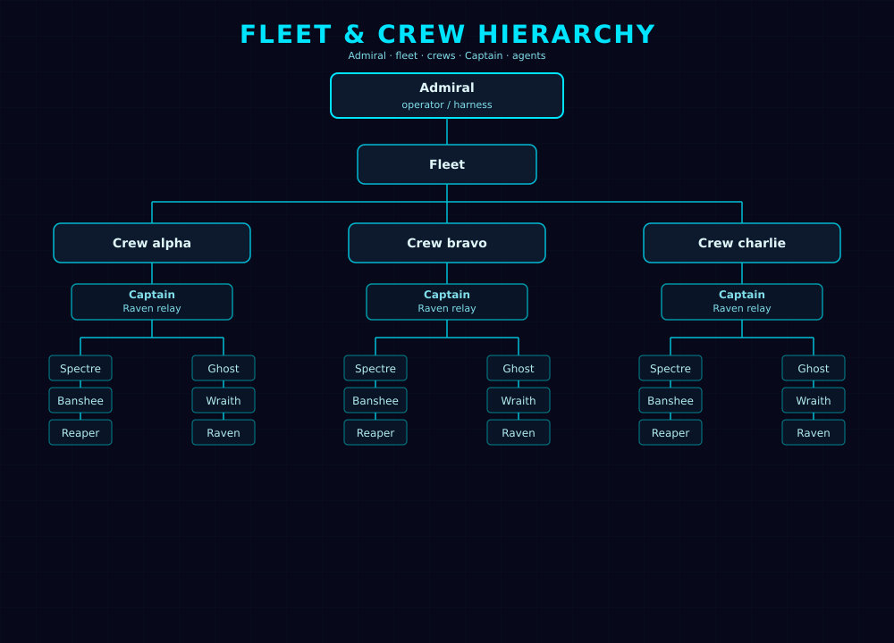
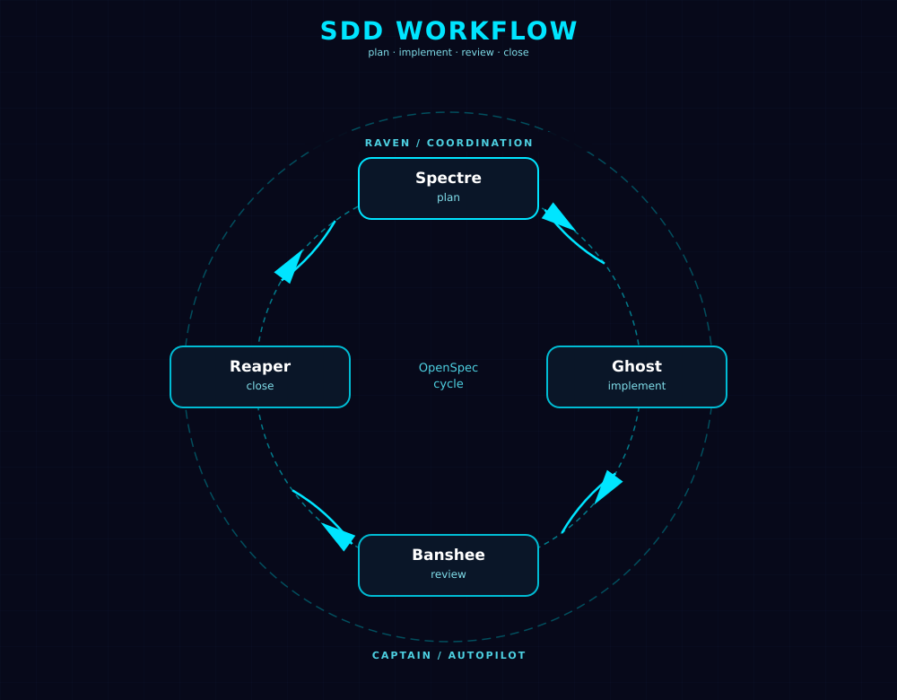

# Architecture

## Components

**ga-transport** — the MCP server (`transport/server.py`). Runs as a plain
`podman run` container, bound straight to `localhost`. Manages crew
containers via the Podman socket. Exposes the `ghostship` tools (see the
main README). Optionally runs on a **dedicated Podman machine** (macOS) or
**dedicated systemd socket-activated instance** (Linux), isolated from the
host's default Podman runtime — see `GA_DEDICATED_MACHINE` in
[configuration.md](configuration.md). When enabled, crew containers live on a
separate instance with its own storage, network, and lifecycle, eliminating
resource contention with other host workloads.

**Crew containers** — on-demand KiroCrew instances, each a **ghostship**
(`localhost/spec-ops:latest`), named `gs-<id>`. Each has two
volumes: a workspace volume (`gs-vol-<id>`) and a home volume
(`gs-home-<id>`). Created by `launch`, torn down by `nuke`. All join
`ga-starboard` so transport can reach them by container name
(`http://gs-<id>:5476`). Crew containers are isolated from `ga-portal` by
network topology — see the Networking section below.

**Crew image** (`crews/spec-ops/Containerfile`) — extends the official `ghcr.io/kirodotdev/kirocrew:0.4.0`
(Debian 12 bookworm, Python 3.12, git, curl). Adds Node.js 24 LTS via NodeSource, and
the `openspec` CLI (`@fission-ai/openspec`) that the `openspec-*` skills shell
out to. Built locally at install time (`localhost/spec-ops:latest`) as part of
a three-stage build:

1. **`base-admission`** (`crews/_base/admission/`) — mail stack and auth
   layer: installs `mailutils`, `msmtp-mta`, provisions Maildir structure, and
   adds `maildeliver` and `verify-admiral-sig`. Extends
   `ghcr.io/kirodotdev/kirocrew:0.4.0`.
2. **`spec-ops` composition** (`crews/spec-ops/`) — adds Node.js 24 LTS and
   the `openspec` CLI. Extends `base-admission`.
3. **`base-graduation`** (`crews/_base/graduation/`) — runs `seed_kiro_db.py`
   to pre-seed the kiro-cli SQLite DB schema so auth injection works without
   running migrations at every launch. Extends the `spec-ops` intermediate
   image to produce the final `localhost/spec-ops:latest`.

See [configuration.md](configuration.md#extending-the-crew-image) to add packages.

## Ghost Academy



Every ghostship is built from the same foundation: [`academy/agents/`](../academy/agents/),
[`academy/skills/`](../academy/skills/), and
[`academy/steering/`](../academy/steering/) — the Ghost Academy's shared
curriculum, bind-mounted into transport and copied into every crew at
`launch` (steps 9–11 below), filtered against the crew type's manifest
(`crews/<crew-type>/manifest.json`, also bind-mounted into transport). Each
manifest key (`agents`, `skills`, `steering`) is either the literal string
`"*"` or an explicit array of exact names to include from the
corresponding Academy pool. The only crew type today, `spec-ops`
(`crews/spec-ops/manifest.json`), specifies `"*"` for every key, so every
ghostship still gets the whole curriculum in practice — the manifest is
groundwork for a future second crew type to select a different combination,
not a restriction on this one. Within whatever a crew type's manifest
selects, it's each persona's own prompt that narrows its focus further, not
a technical restriction (see
[agents.md](agents.md#steering-not-enforcement)).

Development inside a ghostship runs on
[OpenSpec](https://github.com/Fission-AI/OpenSpec)'s spec-driven
workflow — explore → propose → apply → archive — which the five worker
personas split up between them: Spectre drives the front half
(explore, propose, update-change), turning an idea into a spec-backed
plan before Ghost implements it and Reaper syncs specs and archives the
change. Raven is the sixth, coordination-only persona for recurring
standing-orders work. See [agents.md](agents.md) for what each persona owns,
and [Steering](#steering) below for the crew-wide context every persona gets
regardless of its own prompt.



## Crew lifecycle

```
launch(crew_id)
  1. Check the ga-kiro-auth file (DATA_DIR/ga-kiro-auth, not a Podman secret)
     └── missing → start kiro-cli device auth flow, return login URL
                   call launch again after auth to finish setup
  2. Create gs-vol-<id> + gs-home-<id> volumes
  3. Start crew container (localhost/spec-ops:latest)
  4. Wait for gateway ready (GET / on :5476, 30s timeout)
  5. Inject kiro-cli auth rows into crew's SQLite DB
  6. Inject the admiral signing secret (random 32-byte hex) into
     `~/.kiro/crew/.admiral_secret` (mode 0600). The secret is piped in over
     stdin, never passed as an exec argument, so it never appears in
     `podman exec` argv or `/proc/<pid>/cmdline` (TRN-93). The plaintext is
     also persisted to `DATA_DIR/secrets/<id>` so Captain can sign standing
     orders; `crews.json` stores only a non-reversible identifier.
  7. Patch KiroCrew config (`agent`, `dangerously_skip_permissions=true`,
     `spawn_min_memory_gb=GA_SPAWN_MIN_MEMORY_GB` [1.5 default],
     `resource_pressure_gb`, `resource_critical_gb`, `subagent_timeout_secs`,
     `subagent_max_turns`, `default_agent=ghost`, `reasoning_effort=max`)
  8. Restart container (workers pick up auth + config)
  9. Wait for gateway ready again
  10. Copy manifest-selected agent JSONs (spectre/ghost/banshee/reaper/wraith/raven,
     by default) from /agents bind-mount
  11. Copy manifest-selected skill dirs (openspec-*, ghostship-mail, ..., by default)
      from /skills bind-mount
  12. Copy manifest-selected steering docs (all, by default) from /steering
      bind-mount (see below)
  13. Seed a shared OpenSpec store at the workspace root (see below)
  14. Inject git author identity — a no-op at this step; `GA_GIT_AUTHOR_NAME`/
      `GA_GIT_AUTHOR_EMAIL` are set as container env vars at container-create
      time so they are part of the process environment from startup
  15. Inject the governance policy: HMAC-SHA256-sign the canonical policy body
      with a dedicated `policy_signing_key` (distinct from `admiral_secret`) and
      write `security_policy.json` + `admission_policy.json` into `~/.kiro/crew/`
      (see [Operator governance](#operator-governance)). Failure is logged but
      never aborts launch
  16. Patch agent model files to the model pinned in each agent's JSON
  17. Mint a session token with `KC_GATEWAY_TOKEN_TTL` (24h default), exchange for cookie
  18. Register in /data/crews.json with `last_used` set to setup completion time
  └── returns { status: "ready" } (~30s)

nuke(crew_id, confirm=True)
  └── stop container, remove container + both volumes, deregister
```

### Repository transfer

See [Seed or extract a Git repository](../README.md#seed-or-extract-a-git-repository)
in the README for full bundle instructions. In short: create a bundle locally,
call `supply(path="repo", crew_id="<id>", bundle=True)`, and POST the bundle
bytes to the returned URL. For extraction, call `evac(path="repo", ...,
bundle=True)` and clone or fetch the downloaded bundle.

### Captain supervision

The manual persona sequence remains the default. Captain has one opt-in
mechanism per crew: an Admiral calls
`captain(crew_id, action="order", message="<standing order>", interval=<n>)`
or supplies a cron expression. The transport appends the order to the crew's
`captain@localhost` mailbox and ensures one recurring `/api/crons` job named
`captain` dispatches Raven with a persistent session. When `interval` is set,
Raven is also dispatched once immediately on job creation (before the first
interval tick) by default — `fire_immediately=False` suppresses this, and
`fire_immediately=True` enables it for cron-based check-ins. Resuming a
previously paused job never triggers an immediate dispatch.

For standard OpenSpec work, use the built-in template:
`captain(crew_id, action="order", template="sdd", change_name="<change>",
interval=<n>)`. Its fixed prose tells Raven to assess real OpenSpec status and
`tasks.md` state as a whole, dispatch Spectre while planning is incomplete,
Ghost while tasks remain unchecked, Banshee for an independent review, and
Reaper to sync specs and archive after a clean review. One unresolved review
cycle may be fixed and re-reviewed; unresolved findings after that cycle are
escalated to the Admiral, and archival is confirmed from OpenSpec state.

`captain(..., action="status")` reports whether the Raven job is enabled, its
last-run summary, and both Captain and Admiral mailbox counts. `action="stop"` pauses the job
with `POST /api/crons/{job_id}/enable` rather than deleting its history or
mailbox. A scheduled check-in has a `job_id`, not a dispatch `task_id`, so
`steer` is not its control channel. The `transport://orders` resource exposes
the name, description, and complete body of every built-in template alongside
the `transport://agents` roster resource.


## Steering

kiro-cli loads every `.md` file under `~/.kiro/steering/` for every session,
regardless of working directory — unlike agents and skills, which apply per
persona or per skill, steering is crew-wide standing context every dispatched
task gets automatically. `_copy_steering` copies the crew type's
manifest-selected `.md` files from `academy/steering/` into that path at
every `launch` (`"*"` for the `spec-ops` crew type today).

Kept deliberately narrow: environment facts every persona needs regardless of
its own prompt (the working-directory isolation model, the shared OpenSpec
store, when to reach for mail) — not project conventions, which belong in
whatever repository the caller delivers into `repo/` and get read naturally
as part of exploring that codebase. See
[academy/steering/STANDING_ORDERS.md](../academy/steering/STANDING_ORDERS.md)
for the current content.

## Shared OpenSpec store

Every `dispatch` runs in its own `subagent_<task_id>/` subdirectory —
isolated from every other task in the same crew, including earlier ones.
Left alone, this means two agents can never share OpenSpec state: one
proposing a change and another later implementing it would each resolve
`openspec` commands to their own private, empty store and never see each
other's work (the `openspec-*` skills document the resolution rule: without
an explicit `--store`, commands act on "the nearest local `openspec/`
root" — a git-like upward directory search).

`launch` closes that gap by running `openspec init --tools none
--no-animation --force` once at the workspace root (`_seed_openspec_store`
in `server.py`), a level above every `subagent_*/` dir. Every dispatched
task's `openspec` commands then resolve up to that same shared store
automatically — no path-passing between agents required. It sits as a
sibling to `repo/` (where a caller may deliver a project's working tree or
Git bundle), never inside it, so this never touches or pollutes a user's own
repository. `--force` makes the call idempotent, safe on every `launch`.

## Task retention and force-stop

Every `dispatch` request asks the crew gateway for a dedicated, retained run
(`keep=true`). This keeps each task's session data independent and available
for later continuation, including after a forceful stop.

`steer(task_id, message, crew_id, force=False)` preserves the normal turn-boundary
behaviour by default: a running task receives `/steer`, while a completed task
uses `/continue`. With `force=True` on a running task, transport first calls
`DELETE /api/spawn/{task_id}` to stop that task's process, then calls
`POST /api/spawn/{task_id}/continue` with the message and returns
`force_redeployed`. A completed task follows the normal `/continue` path even
when `force=True`.

Recurring jobs created by `schedule` use the KiroCrew gateway's retained
`persistent_session=True` default for `/api/crons`; the cron REST path does not
use the direct `/api/spawn` `keep` field.

`pickup(task_id=None, crew_id=None, timeout_secs=0)` is the unified status and
polling tool. `bridge` is removed — use `pickup(timeout_secs=N)` directly
(also aliased as: bridge, patrol, poll, watch, wait, monitor, hold).

- **timeout_secs=0 (default):** check once and return immediately.
- **timeout_secs > 0:** poll every 3s until the task completes or the timeout
  elapses. Returns the not-done state on timeout without raising an error.

`pickup` always includes mail state in its response:

- **Single-task:** `agent_mail` (unread count for the task's agent persona) and
  `admiral_mail` (Admiral mailbox count).
- **List-all:** `mail_summary` (dict of persona → count for all personas with
  unread mail) and `admiral_mail`.

When polling (`timeout_secs > 0`), `pickup` captures the Admiral mail count at
loop start. If the count increases during any poll cycle, it returns early with
`reason: "admiral_mail"` alongside the current state, allowing the caller to
react to escalations without waiting for the full timeout.

## Idle stop + auto-restart

Crew containers are stopped automatically after `GA_IDLE_TIMEOUT_SECS` (default
300s) of no activity. This timer uses the registry's `last_used` timestamp;
setup initialises it when a crew is first registered as running. Active
`dispatch` tasks refresh the timestamp and prevent a stop. Cron executions are
tracked separately by the crew gateway, so a running cron or a cron whose
`last_run_ts` is newer than the registry timestamp also refreshes `last_used`.
An enabled schedule by itself does not pin a crew or proactively wake it; if no
execution occurs within the idle window, the container may stop and the next
transport call restarts it.

**Captain check-in interval:** The recommended Raven check-in interval is 60s
(`interval=60`). This keeps the gap between a worker task finishing and Raven
noticing well inside the idle timeout, so an active SDD cycle never accidentally
idles the container between steps. The 300s idle timeout provides a comfortable
safety margin even at 60s polling.

On the next `dispatch`, `pickup`, `steer`, `evac`, `supply`, or
`schedule` call, `_ensure_crew_running` detects the stopped container, restarts it,
waits for the gateway, and refreshes the session cookie — all
transparently before forwarding the request or returning a presigned URL.
`pickup(timeout_secs > 0)` performs this recovery before beginning its polling loop.
`supply` performs this recovery during the MCP tool call before signing its
upload URL. The later file POST repeats the recovery check because a crew can
idle-stop after URL issuance; file GET requests do the same for `evac`.

Concurrent restart races are serialised with a per-crew `threading.Event` — the
first caller does the restart, subsequent callers wait then use the refreshed
crew dict.

## Known workarounds

These are deliberate hacks for upstream bugs or limitations. Each is marked with
`# WORKAROUND:` in the source and should be removed when the upstream issue is
fixed. See [docs/troubleshooting.md](troubleshooting.md#known-workarounds) for
the full inventory and removal conditions.

## Rebuilding images

`podman start` (used by `_ensure_crew_running` for idle-stop recovery, and by
`nuke`'s counterpart on transport restart) restarts the *existing* container
object — it does not recreate it from the current image tag. A container is
bound to whichever image it was created from at `podman run` time, so
rebuilding `localhost/transport:latest` or `localhost/spec-ops:latest`
has no effect on containers that already exist; only a fresh `podman run`
(i.e. `install.sh` for transport, `launch` for a crew) picks up the new
image.

| You rebuilt... | What needs recreating | How |
|:----------------|:-----------------------|:----|
| `transport/` (`localhost/transport:latest`) | The `ga-transport` container | `./install.sh` — it `podman rm -f`s and re-`run`s `ga-transport` unconditionally, no crew impact |
| `crews/spec-ops/Containerfile` (`localhost/spec-ops:latest`) | Each existing crew container | `nuke(crew_id, confirm=True)` then `launch(crew_id)` per crew — destroys that crew's workspace and home volumes, so pull out anything needed via `evac` first |

Restarting a stopped crew (idle-stop recovery, or transport's own reboot
`_reconcile_registry` pass) never picks up a rebuilt crew image — it's the
same container, just started again. Only `nuke` + `launch` recreates it
against the current `localhost/spec-ops:latest`.

## Reboot recovery

## Starting and restarting

`./start.sh` brings ghostship back up after a stop — it starts the Podman
service (or machine on macOS) and the `ga-transport` container. Safe to run
any time; does nothing if things are already running.

```bash
./start.sh                            # auto-discovers config
./start.sh --config ~/ghostship.conf  # explicit config
./start.sh --machine-name my-academy  # override machine name
```

`start.sh` uses `podman compose up -d` against a Compose file generated at
install time and stored at `${DATA_DIR}/compose.yml` (typically
`~/.local/share/ghost-academy/data/compose.yml` on Linux,
`~/Library/Application Support/ghost-academy/data/compose.yml` on macOS).
Compose handles "already running", "stopped", and "container doesn't exist"
transparently — no separate cold-boot fallback is needed.

Config discovery order (first match wins):
1. `<ghostship-dir>/ghostship.conf` — next to `start.sh`
2. `~/ghostship.conf` — home directory
3. `~/.config/ghostship/ghostship.conf` — XDG

If no config is found it prompts interactively. If multiple are found it
lists them and asks you to choose.

On Linux with systemd, `start.sh` uses `systemctl --user start` to bring
up the Podman service. Without systemd (WSL) it falls back to spawning the
Podman service directly as a background process.

**Linger (Linux):** `install.sh` runs `loginctl enable-linger` so the user's
systemd slice stays alive after logout. Without linger, headless/SSH-only
servers tear down all user services — including the Podman service and the
transport container — when the last login session ends. Linger is low-risk
(it only keeps the user's slice resident) and is required for unattended
operation. See `docs/troubleshooting.md` for verification steps.

On transport startup, `_reconcile_registry` checks all registered crews:
- Container missing → remove from registry
- Container stopped → restart it, refresh cookie, mark running

## Project layout

```
ghostship/
├── install.sh             # builds images, sets up podman service/machine, runs transport
├── start.sh               # starts Podman + ga-transport; run after a reboot or manual stop
├── uninstall.sh           # tears down transport; --purge-auth also removes kiro-cli credentials
├── transport/             # transport MCP server
│   ├── Containerfile
│   ├── server.py
│   └── requirements.txt
├── academy/               # Ghost Academy: the shared pool crews are composed from
│   ├── agents/            # KiroCrew agent definitions — see docs/agents.md
│   │   ├── ghost.json
│   │   ├── spectre.json
│   │   ├── banshee.json
│   │   ├── wraith.json
│   │   ├── reaper.json
│   │   └── raven.json
│   ├── skills/            # KiroCrew skill files, manifest-selected per crew type
│   │   ├── openspec-*/    # explore/propose/apply-change/update-change/sync-specs/archive-change
│   │   └── ghostship-mail/  # inter-agent mbox messaging
│   ├── steering/          # crew-wide standing context, manifest-selected per crew type — see docs/architecture.md#steering
│   │   └── STANDING_ORDERS.md
│   ├── orders/            # built-in Captain standing-order templates (e.g. sdd)
│   └── policies/          # governance policy templates (on-disk repo path; bind-mounted as /policies/<composition>.json inside the container at launch)
├── .claude-plugin/        # dual-format plugin package (Agent Plugins v1.0.0 + Claude Code) — for whoever holds the MCP connection, never copied into a crew
│   ├── plugin.json        # Agent Plugins manifest (name, version, description, ...)
│   ├── .claude-plugin/plugin.json  # Claude Code manifest (nested per its own convention)
│   ├── mcp.json            # Agent Plugins MCP entry — loopback default only, no secrets (spec-forbidden)
│   ├── .mcp.json           # Claude Code MCP entry — same server, no $schema
│   ├── marketplace.json    # Claude Code marketplace catalog entry
│   ├── PACKAGING.md        # scope/caveats of the manifests above
│   └── skills/
│       ├── EXTERNAL_SKILLS.md # what this directory is, vs. academy/skills/
│       ├── ghostship-admin/   # install, connect a client, upgrade, tear down — no MCP connection assumed
│       └── ghostship-command/ # drives an already-connected fleet: launch, dispatch, pickup/steer, Captain, nuke
├── config/                # example config files (ghostship.conf.example)
├── crews/                 # crew type definitions — each composes a crew from academy/
│   ├── registry.json      # registered crew types
│   ├── _base/
│   │   ├── admission/     # stage 1: mail stack + auth layer (extends ghcr.io/kirodotdev/kirocrew:0.4.0)
│   │   └── graduation/    # stage 3: kiro-cli DB pre-seed (seed_kiro_db.py)
│   └── spec-ops/          # stage 2: the one crew type today — adds Node.js 24 LTS + openspec CLI
│       ├── Containerfile
│       └── manifest.json  # which academy/ agents, skills, steering this crew type includes
├── tests/                 # test suite (unit/, integration/, e2e/)
├── openspec/              # this project's own OpenSpec state (config.yaml, changes/, specs/)
└── docs/                  # this folder
```

## Mail system migration (trn-1-unix-mail)

### Breaking change: mbox → Maildir

Prior to this change, inter-agent mail used flat mbox files at
`/var/mail/<persona>` (a single file per persona, messages appended as
RFC 2822 entries with `From ` envelope separators). After this change, the
same paths (`/var/mail/<persona>`) are Maildir directories with `new/`,
`cur/`, and `tmp/` subdirectories. Each message is a separate file,
delivered atomically via rename.

**Existing crews (pre-trn-1-unix-mail) must be nuked and relaunched.**
The Containerfile change installs `mailutils`, `msmtp-mta`, and `procmail`,
provisions Maildir structure, and copies delivery configuration into the
image. The new image is not backward-compatible with existing mbox
mailboxes — the old flat files cannot be read by the new Maildir-aware
tooling, and the new delivery scripts expect directory structure that does
not exist in old containers.

### New capabilities in the mail system

- **Atomic delivery**: Maildir uses tmp → new rename (no corruption under
  concurrent writes)
- **Threading**: every message carries `Message-ID`; replies include
  `In-Reply-To` and `References`
- **Supersedes**: replacement standing orders carry a `Supersedes:` header
  so Raven can identify current orders without full history scan
- **HMAC signing**: Admiral mail carries `X-Admiral-Sig` (HMAC-SHA256 of
  body); `verify-admiral-sig` validates authenticity inside the crew
- **Plus-addressing**: `ghost+taskid@localhost` routes to `/var/mail/ghost/`
  via the `maildeliver` script

## Operator governance

Ghostship uses the KiroCrew **operator tier** — a static-file-at-boot
governance model where the transport writes config files into each crew
container during setup, and the gateway enforces them as an unforgeable
ceiling the agent cannot weaken. No code runs inside the gateway for
governance; the files are the API.

### How policy files are injected

During `_finish_crew_setup`, after the `admiral_secret` is generated and
injected:

1. The transport reads a policy template from `/policies/<composition>.json`
   inside the transport container (bind-mounted from `academy/policies/` on the
   host at container start). If no composition-specific template exists,
   `/policies/default.json` is used.
2. The canonical (sorted-keys) JSON body is HMAC-SHA256 signed using the
   crew's `admiral_secret`.
3. Two files are written into `~/.kiro/crew/` inside the container:
   - `security_policy.json` — the governance ceiling
   - `admission_policy.json` — contains `require_policy_signature: true`
     and the HMAC signature as a trust key
4. The `policy_version` is stored in the crew registry and returned in
   `launch()` and `crews()` responses.

Policy injection failure is logged but never aborts crew launch.

### Customising per composition

Policy templates live in `academy/policies/`:

| Template | Used by | Description |
|:---------|:--------|:------------|
| `default.json` | `spec-ops` (and any composition without its own template) | Platform-integrity focus: blocks `git push`, `gh`, pipe-to-shell, messaging integrations |
| `research.json` | `kirocrew-research` | Same as default; starting point for customisation |
| `strict.json` | Example only (not applied by default) | Adds `sandbox.min_level`, `filesystem.write` bounds, broader command denials |

To apply tighter controls, create a new composition with its own policy
template (e.g. `academy/policies/kirocrew-strict.json`) and launch crews
with that composition name.

### Security properties

- The container is the security boundary. Default policy covers platform
  integrity only — no filesystem, sandbox, or network restrictions.
- Policy is HMAC-signed with the `admiral_secret`. A tampered policy causes
  the gateway to detect a signature mismatch and refuse to continue.
- The agent has no path to the `admiral_secret` and cannot forge a valid
  policy signature.
- Policy is set once at launch. To change policy, nuke and relaunch the
  crew.

## Networking (TRN-107: Portside/Starboard split)

Ghost Academy uses two static Podman networks, replacing the retired `ga-net`:

```
  Internet / host
       │
  [ga-portal] ──────────────────────────────┐
       │        ga-portside                  │
  [ga-transport]                            │
       │        ga-starboard                │
  [gs-alpha]  [gs-beta]  [gs-gamma]  ...   │
  (all crews, login containers)             │
                                           │
  GA_TRANSPORT_SECRET flows on ga-portside ───┘
  (ga-transport rejects any request missing X-Transport-Token)
```

**ga-portside** — connects `ga-portal` (Caddy) and `ga-transport` only. Crew
containers are NOT on this network and cannot reach `ga-portal` by hostname.

**ga-starboard** — connects `ga-transport` and all crew containers (`gs-*`)
plus ephemeral `ga-login-*` containers. `ga-portal` is NOT on this network
and cannot reach crew containers by hostname.

### Three-control security model

1. **Network split** — `ga-portal` cannot resolve crew container hostnames;
   crew containers cannot resolve `ga-portal`'s hostname.

2. **GA_TRANSPORT_SECRET** — `ga-portal` (Caddy) injects `X-Transport-Token` on
   every upstream request (MCP, files, dashboard, health). `ga-transport`'s
   `TransportSecretMiddleware` rejects any request missing or presenting a wrong
   token with HTTP 401. Crew containers on `ga-starboard` can dial
   `ga-transport` at the TCP layer but never receive `GA_TRANSPORT_SECRET` and
   therefore cannot forge the header.

3. **IP-bound cookies** — crew gateway cookies (`mc_token_5476`) are bound to
   the originating IP. A cross-crew session attempt returns 403. This closes
   crew→crew session hijacking.

### GA_TRANSPORT_SECRET lifecycle

- Generated by `install.sh` using `openssl rand -hex 32` and stored as Podman
  secret `ga-transport-secret` (idempotent — skipped if already exists).
- Mounted into `ga-transport` at `/run/secrets/ga-transport-secret`.
- Mounted into `ga-portal` at `/run/secrets/ga-transport-secret`; Caddy reads it
  via `{file./run/secrets/ga-transport-secret}` placeholder in the reverse proxy
  handler config.
- Registered with the transport's log redaction filter at startup; never
  appears in logs or error messages.

### Migration from ga-net

On the first startup after upgrading from a version using `ga-net`,
`_reconcile_registry` detects crews still on `ga-net` and migrates each one:

1. Connects `ga-transport` to `ga-starboard` (idempotent).
2. Stops the crew container.
3. Disconnects it from `ga-net` (best-effort).
4. Connects it to `ga-starboard`.
5. Starts it, waits for the gateway, and refreshes the session cookie.

After all crews are migrated, `ga-net` is removed if empty (best-effort).
`install.sh` also attempts a best-effort `ga-net` removal at the end.
